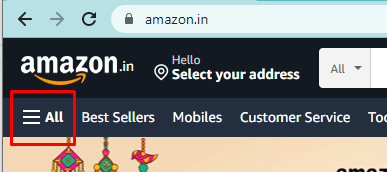
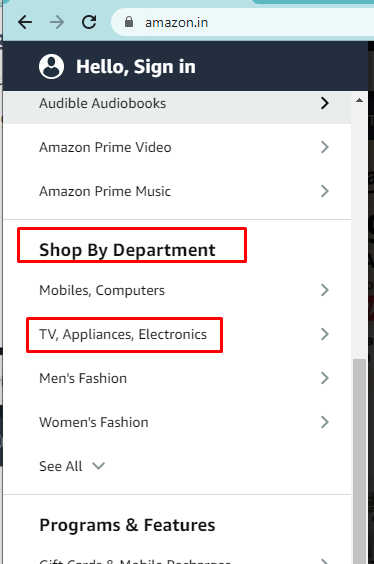
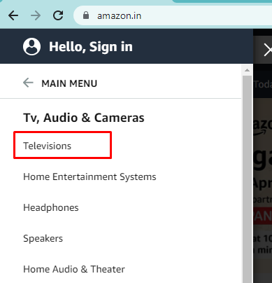
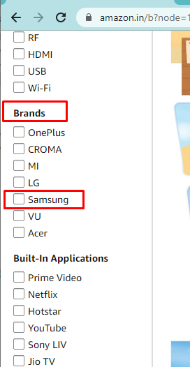
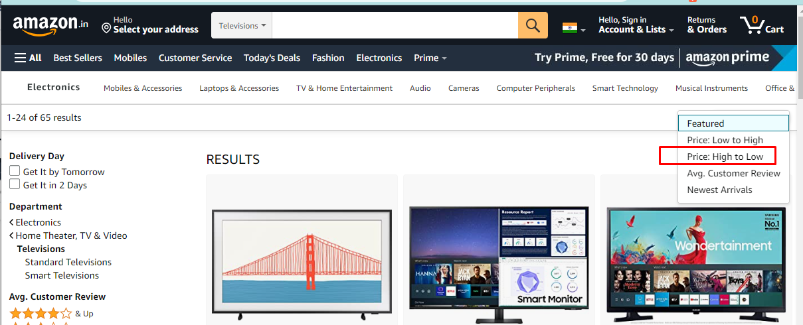
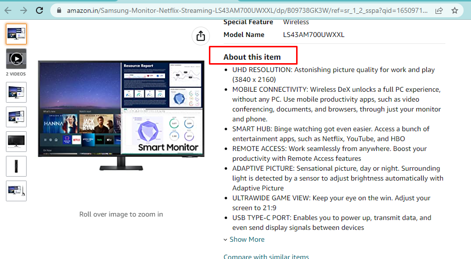

# Clipboard Health

## Automation framework (ATF)

### Quick Start

1) Cucumber feature:</br >
   `modules/amazon/ui/src/test/resources/features/../*.feature`
2) Gradle task:</br >
   Open terminal in root project folder

```
gradle :modules:amazon:ui:tests 
```

Then you will be able to Generate Allure

```
gradle :modules:amazon:ui:allureReport
gradle :modules:amazon:ui:{allure_env,allureReport}
```

Run and Generate Allure

```
gradle :modules:amazon:ui:{clean,tests,allure_env,allureReport} -Dthreads=1 -Dbrowser=chrome -Dbrowser.resolution='1920x1080'
```

### Dependencies

| Automation Feature (Tool) |                             Links                              |
|---------------------------|:--------------------------------------------------------------:|
| Rest-Assured              |    https://github.com/rest-assured/rest-assured/wiki/Usage     |
| Cucumber                  |               https://cucumber.io/docs/cucumber/               |
| Allure                    |                   http://allure.qatools.ru/                    |
| Selenide                  |            https://selenide.org/documentation.html             |
| Selenoid                  |             https://aerokube.com/selenoid/latest/              |
| Selenoid browser images   | https://aerokube.com/images/latest/#_browser_image_information |

### Project default global variables (VM options)

| Variable             | Default                          |                        Description                        |
|----------------------|----------------------------------|:---------------------------------------------------------:|
| `selenoid.enable`    | `false`                          |           For remote run change value by `true`           |
| `selenoid.video`     | `false`                          | if  CI is `true` you can enable recording video by `true` |
| `selenoid.remote`    | `http://127.0.0.1:4444/wd/hub`   |                    Selenoid remote url                    |
| `browser`            | `chrome`                         |                     Configure browser                     |
| `browser.resolution` | `1366x768`                       |                  Set browser resolution                   |
| `threads`            | `1`                              |      Number of threads (use with parallel execution)      |

### LOCAL

1) Use [Quick start](#Quick-Start)
2) Or run in terminal

```
gradle :modules:amazon:ui:{clean,allure_env,tests,allureReport} -Dcucumber.tags='@scope:regression'
```

### LOCAL + DOCKER SELENOID
1) Open terminal and Make Checkout `:modules:amazon:ui` subproject
```
cd modules/amazon/ui
```

2) Selenoid
   - Make docker pull
```
docker pull selenoid/vnc_chrome:106.0
docker pull dumbdumbych/selenium_vnc_chrome_arm64:91.0.b
docker pull selenoid/video-recorder:7.1
```
   - Up selenoid
```
docker run -d --name selenoid -p 4444:4444 -v /var/run/docker.sock:/var/run/docker.sock -v ${PWD}/selenoid/config/:/etc/selenoid/:ro -v ${PWD}/selenoid/config/video/:/opt/selenoid/video/ -v ${PWD}/selenoid/config/logs/:/opt/selenoid/logs/ -e TZ=Europe/Minsk -e OVERRIDE_VIDEO_OUTPUT_DIR=${PWD}/selenoid/config/video/ aerokube/selenoid:1.10.8 -log-output-dir /opt/selenoid/logs -video-recorder-image selenoid/video-recorder:7.1 -capture-driver-logs
```

Health check: http://127.0.0.1:4444/status

3) Open Terminal > Back to Root directory and run command
```
gradle :modules:amazon:ui:{clean,allure_env,tests,allureReport} -Dselenoid.enable=true -Dcucumber.tags='@scope:regression'
```

### DOCKER SELENOID + DOCKER GRADLE

```
docker run --rm -u gradle -v ${PWD}:/home/gradle/project -w /home/gradle/project --link selenoid gradle:6.9.2-jdk11 gradle :modules:amazon:ui:{clean,allure_env,tests,retry,allureReport} -Dselenoid.enable=true -Dcucumber.tags='@scope:regression'
```

## Specification

# Introduction

SDET or a Engineering Manager in Quality, we are pretty hands on when it comes to Quality.

In the assignment, we are looking to see your design and coding skills to see how well you can take care of Quality;
within the quality department.

In this exercise, we provide a single automation problem to solve, and the goal is to see if you can design a clean UI
automation solution around it. The only requirement is to `use Java` as the core programming language (`Since this is the language of choice that we have decided to go forward with. It also makes it possible for us to properly review the assignments since we are not experts in all the different programming languages that can be used to do automation.`).

You can use any automation tool/library of your choice - we like selenium but feel free to take your pick.

If you like, we also provide you a base test framework so that you can directly get started writing tests, rather than setting up framework. [This framework]

Note: Base (vanilla) framework is to help you get things faster - “if you want to”. However we realize, sometimes you may like to use your own tool set, in which case you are free to do so - with no marks deducted - so feel free to pickup whatever you like :).

> One request, don’t use any low code or licensed automation tools.

Wish you all the best and success in getting this assignment done!

## Assignment

Web Automation: [Amazon](https://www.amazon.in/)

## Checklist of what we expect from this assignment ?

- [ ] Completion of the assignment.
- [ ] Test should run and pass in Chrome browser.
- [ ] Platform independent. (It should run on Windows, Mac or linux)
- [ ] Better page layer management.
- [ ] Helper methods for page interactions like click, sendkeys.
- [ ] Readable and clean code.
- [ ] Clear instructions about the framework and how to execute in the readme file.
- [ ] Commits history to see how you have approached the problem.
- [ ] Following good design principles.

> Note: Some of these requirements are intentionally kept vague.
> We want to see "the best" that you normally can deliver than leading you towards one way or another.

## What can get you closer to the job ?

- [ ] Unit tests if applicable.
- [ ] Framework having the provision to run the test in local or selenium grid/selenoid.
- [ ] Dockerizing the framework itself. (Build a docker image for the automated tests)
- [ ] Good design patterns wherever applicable.
- [ ] Anything that can help you to impress us.

## Steps

1. Open <https://www.amazon.in/>.
   > Note: Clicking on above URL may redirect you to amazon.com. Change it to amazon.in
2. Click on the `hamburger menu` in the top left corner.

   
3. Scroll own and then Click on the `TV, Appliances and Electronics` link under `Shop by Department` section.

   
4. Then click on `Televisions` under `Tv, Audio & Cameras` sub section.

   
5. Scroll down and filter the results by Brand ‘Samsung’.

   
6. Sort the Samsung results with price High to Low.

   
7. Click on the second highest priced item (whatever that maybe at the time of automating).
8. Switch the Window
9. Assert that  “About this item” section is present and log this section text to console/report.

   